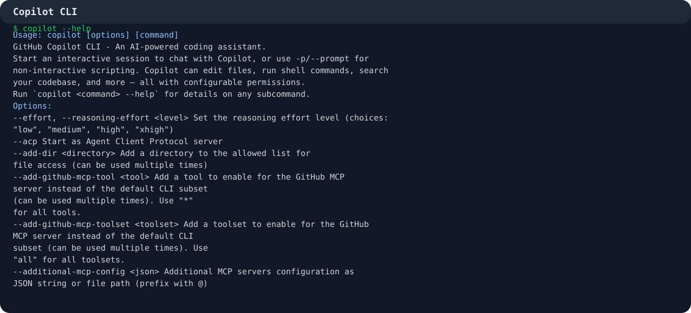
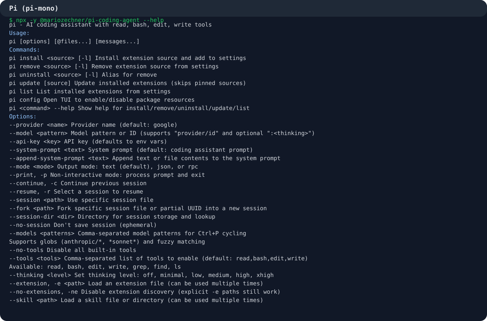
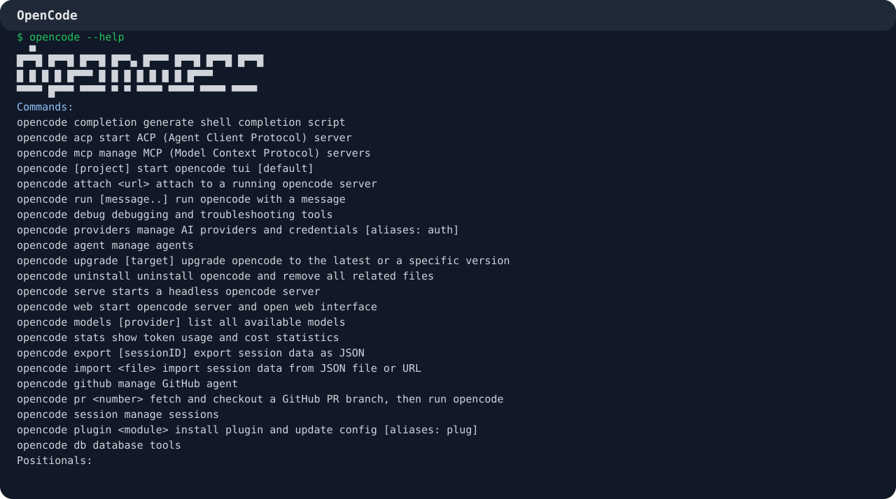
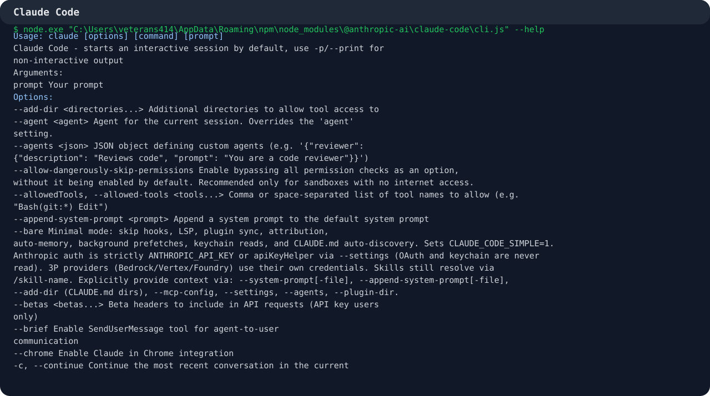

# Investigación: Desarrollo Agéntico (2026)

Esta investigación resume cómo se practica hoy el **desarrollo agéntico** y compara cuatro herramientas actuales: **Copilot CLI**, **Pi (pi-mono)**, **OpenCode** y **Claude Code**.

## Qué es el desarrollo agéntico

En 2026, el desarrollo agéntico es la forma de construir software donde un LLM no solo responde, sino que:

- planifica tareas,
- usa herramientas,
- mantiene contexto o memoria,
- ejecuta pasos de forma iterativa,
- y opera con guardrails humanos.

La diferencia clave es esta:

- **Workflow**: flujo predefinido.
- **Agente**: decide dinámicamente qué herramientas usar y en qué orden.

Los patrones más comunes hoy son:

- chaining de prompts,
- routing,
- paralelización,
- orchestrator/workers,
- evaluator/optimizer,
- plan -> execute -> verify.

## Qué importa al comparar herramientas

| Herramienta | Mejor para | Agentes | Skills | Rules / instrucciones | Permisos |
|---|---|---|---|---|---|
| Copilot CLI | Flujo GitHub-first | Agentes custom + uso interactivo | Sí | `copilot-instructions`, `AGENTS.md`, `.github/instructions/` | Muy explícitos |
| Pi (pi-mono) | Agente CLI extensible | Runtime + extensiones | Sí | `.pi/settings.json`, `AGENTS.md`, `CLAUDE.md` | Basados en herramientas |
| OpenCode | Control abierto y provider-agnostic | Build/Plan + subagents | Sí | `AGENTS.md`, `opencode.json`, `CLAUDE.md` fallback | `allow / ask / deny` |
| Claude Code | Subagentes maduros y memoria | Explore / Plan / General-purpose | Sí | `CLAUDE.md`, `.claude/rules/` | Permission modes + hooks |

## 1) Copilot CLI

Copilot CLI es la opción más natural si tu trabajo gira alrededor de GitHub, repos, PRs y automatización con permisos explícitos.

### Uso práctico

```bash
copilot
copilot -p "Resume los cambios de la rama actual"
copilot --help
```

### Agentes, skills y reglas

- **Agentes**: soporta agentes built-in y custom agents.
- **Skills**: se cargan como paquetes reutilizables de tareas.
- **Rules / instrucciones**: se expresan con `copilot-instructions`, `.github/instructions/*.instructions.md` y `AGENTS.md`.

### Cuándo conviene

- si el flujo está centrado en GitHub,
- si quieres permisos y herramientas muy explícitas,
- si el trabajo depende mucho de repos, commits y contexto del proyecto.



## 2) Pi (pi-mono)

Pi corresponde al proyecto **pi-mono**; el binario práctico es `pi` y el paquete CLI principal es `@mariozechner/pi-coding-agent`.

### Uso práctico

```bash
npx -y @mariozechner/pi-coding-agent --help
pi -p "Enumera los archivos TypeScript en src/"
pi --tools read,grep,find,ls -p "Revisa el código en src/"
```

### Agentes, skills y reglas

- **Agentes**: la idea central es el runtime del agente y su extensión por paquetes.
- **Skills**: Pi implementa el estándar de Agent Skills con `SKILL.md`.
- **Rules / instrucciones**: usa `.pi/settings.json`, `.agents/skills`, `AGENTS.md` y compatibilidad con `CLAUDE.md`.

Pi es más una **plataforma de agente** que una interfaz cerrada; destaca cuando quieres extender, configurar y componer capacidades.

### Cuándo conviene

- si quieres un agente ligero pero extensible,
- si te interesa el modelo de skills reutilizables,
- si prefieres armar tu propio stack con extensiones y recursos configurables.



## 3) OpenCode

OpenCode es una muy buena opción si quieres una experiencia agéntica abierta, con enfoque en permisos, subagentes y compatibilidad amplia con proveedores.

### Uso práctico

```bash
opencode
opencode run "Explica la arquitectura de este proyecto"
opencode agent list
opencode mcp
```

### Agentes, skills y reglas

- **Agentes**: trae agentes primarios como Build/Plan y subagents como General/Explore.
- **Skills**: se cargan desde `SKILL.md` en `.opencode/skills/<nombre>/`.
- **Rules / instrucciones**: usa `AGENTS.md` y `instructions` en `opencode.json`; también acepta `CLAUDE.md` y `.claude/skills` como fallback.

### Cuándo conviene

- si quieres control fino sobre permisos,
- si prefieres una herramienta open source y provider-agnostic,
- si te interesa una experiencia agéntica moderna pero sin cerrarte a un proveedor.



## 4) Claude Code

Claude Code es de las opciones más maduras para trabajo agéntico interactivo: subagentes, memoria, reglas del proyecto y modos de permiso están muy integrados.

### Uso práctico

```bash
claude
claude -p "Refactoriza este módulo y explica los cambios"
claude --continue
claude --permission-mode plan
```

### Agentes, skills y reglas

- **Agentes**: Explore, Plan y General-purpose, además de agentes custom.
- **Skills**: se definen en `.claude/skills/<nombre>/SKILL.md`.
- **Rules / instrucciones**: `CLAUDE.md` y `.claude/rules/*.md` son la base para reglas persistentes.

### Cuándo conviene

- si quieres una experiencia muy pulida para iterar sobre código,
- si necesitas subagentes y memoria integrados,
- si prefieres un flujo con buenas prácticas de permisos y contexto.



## Comparación rápida

No hay una única ganadora; depende del flujo:

- **Copilot CLI**: mejor si tu entorno vive en GitHub y quieres integración natural con repos y permisos.
- **Claude Code**: mejor opción general para trabajo agéntico interactivo y subagentes bien resueltos.
- **OpenCode**: mejor si priorizas apertura, control y compatibilidad con múltiples proveedores.
- **Pi (pi-mono)**: mejor si quieres una base extensible para construir tu propio agente con skills y configuraciones.

## Buenas prácticas para desarrollo agéntico

- Mantener permisos mínimos.
- Usar instrucciones cortas y específicas por proyecto.
- Convertir tareas repetibles en skills.
- Separar planificación, ejecución y verificación.
- Revisar prompts e integraciones para reducir riesgo de prompt injection.
- Verificar resultados con tests o comandos deterministas.

## Fuentes principales

### Concepto general

- [Anthropic: Building Effective Agents](https://www.anthropic.com/engineering/building-effective-agents)
- [Google Cloud: What are AI agents?](https://cloud.google.com/discover/what-are-ai-agents)
- [Azure: AI agent design patterns](https://learn.microsoft.com/en-us/azure/architecture/ai-ml/guide/ai-agent-design-patterns)
- [NIST AI RMF](https://www.nist.gov/itl/ai-risk-management-framework)
- [OWASP LLM Prompt Injection](https://genai.owasp.org/llmrisk/llm01-prompt-injection/)

### Copilot CLI

- [About Copilot CLI](https://docs.github.com/en/copilot/concepts/agents/about-copilot-cli)
- [Use Copilot CLI](https://docs.github.com/en/copilot/how-tos/use-copilot-agents/use-copilot-cli)
- [Copilot CLI repo](https://github.com/github/copilot-cli)

### Pi / pi-mono

- [pi-mono repo](https://github.com/badlogic/pi-mono)
- [Pi coding agent README](https://github.com/badlogic/pi-mono/blob/main/packages/coding-agent/README.md)
- [Pi skills docs](https://github.com/badlogic/pi-mono/blob/main/packages/coding-agent/docs/skills.md)
- [Pi settings docs](https://github.com/badlogic/pi-mono/blob/main/packages/coding-agent/docs/settings.md)

### OpenCode

- [OpenCode docs](https://opencode.ai/docs)
- [OpenCode repo](https://github.com/anomalyco/opencode)

### Claude Code

- [Claude Code quickstart](https://docs.anthropic.com/en/docs/claude-code/quickstart)
- [Claude Code CLI reference](https://docs.anthropic.com/en/docs/claude-code/cli-reference)
- [Claude Code sub-agents](https://docs.anthropic.com/en/docs/claude-code/sub-agents)
- [Claude Code memory](https://docs.anthropic.com/en/docs/claude-code/memory)
