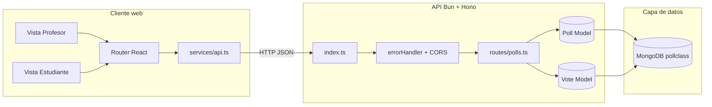

# 02 - Arquitectura general

## Vision general

PollClass implementa una arquitectura web clasica de tres capas. Esta separacion ayuda
a mantener responsabilidades claras: la interfaz se concentra en experiencia de usuario,
la API en reglas de negocio y la base de datos en persistencia.

- Presentacion: React + Vite (`client`)
- Aplicacion/API: Bun + Hono (`server`)
- Persistencia: MongoDB (mediante Mongoose)

## Diagrama de componentes

## Explicacion por capa

### 1) Capa de presentacion (frontend)

El frontend usa React Router para dividir flujos de profesor y estudiante.
Ambos flujos comparten un cliente HTTP comun (`services/api.ts`) que encapsula fetch,
headers, parseo de errores y tipos de respuesta.

Esto evita que cada componente implemente su propia forma de consumir la API y hace
mas mantenible la aplicacion.

### 2) Capa de aplicacion (backend)

El backend arranca en `server/index.ts` y registra:

- CORS global para aceptar peticiones del frontend.
- Middleware de errores para normalizar respuesta `500`.
- Rutas de encuestas en `/api/polls`.

La logica de negocio vive en `routes/polls.ts`: validaciones, generacion de codigo,
control de estado de encuesta, voto unico por estudiante y calculo de resultados.

### 3) Capa de datos (MongoDB)

La persistencia se divide en dos colecciones:

- `Poll`: define la encuesta y el acumulado de votos por opcion.
- `Vote`: registra cada voto individual con trazabilidad por nombre y fecha.

La integridad se refuerza con indices unicos en codigo de encuesta y voto por persona.

## Responsabilidades por modulo

- `client/src/services/api.ts`: punto unico de comunicacion HTTP.
- `server/index.ts`: bootstrap de API, middlewares y bind de puerto.
- `server/routes/polls.ts`: casos de uso del dominio de encuestas.
- `server/models/Poll.ts`: contrato de datos de encuestas.
- `server/models/Vote.ts`: contrato de datos de votos.

## Patron de actualizacion de resultados

El proyecto usa polling en lugar de sockets:

- Profesor: refresco cada 3 segundos en vista de resultados.
- Estudiante: refresco cada 5 segundos despues de votar.

Este enfoque simplifica la arquitectura porque no requiere canales persistentes,
aunque introduce consultas periodicas que deben considerarse si aumenta la concurrencia.
