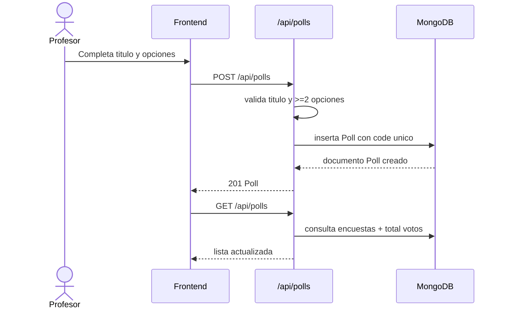
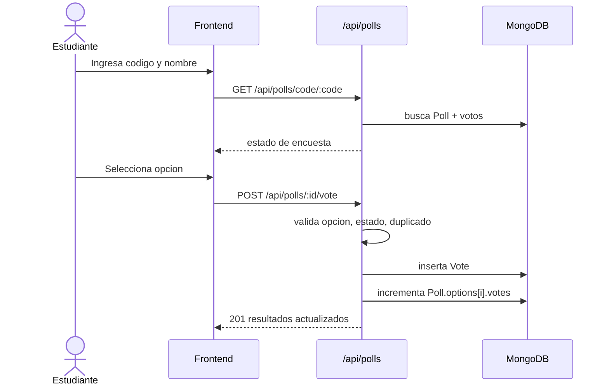
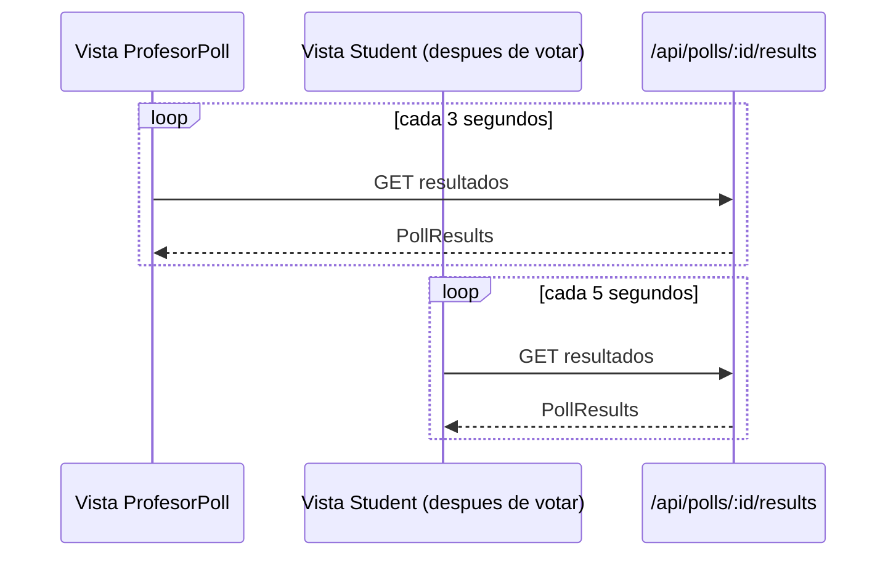
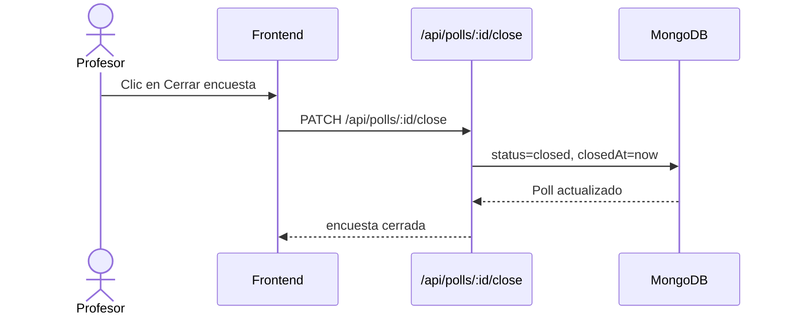

# 03 - Comunicacion entre servicios

## Enfoque de integracion

El frontend y el backend se comunican exclusivamente por HTTP con payloads JSON.
No hay capa de mensajeria ni canal bidireccional persistente; toda accion del usuario
se traduce en una peticion puntual y cada consulta de estado llega por polling.

## Convenciones de la API

- Protocolo: HTTP.
- Formato de intercambio: JSON.
- Base URL en desarrollo: `http://localhost:3001`.
- Prefijo funcional principal: `/api/polls`.

El cliente centraliza estas llamadas en `client/src/services/api.ts`, lo que permite
que las pantallas de profesor y estudiante no dupliquen logica de transporte.

## Endpoints principales

| Metodo | Ruta | Uso |
|---|---|---|
| GET | `/health` | verificacion de disponibilidad de API |
| POST | `/api/polls` | crear encuesta |
| GET | `/api/polls` | listar encuestas |
| GET | `/api/polls/code/:code` | buscar encuesta por codigo de 6 caracteres |
| GET | `/api/polls/:id` | consultar encuesta por id |
| GET | `/api/polls/:id/results` | consultar resultados actuales |
| POST | `/api/polls/:id/vote` | emitir voto |
| PATCH | `/api/polls/:id/close` | cerrar encuesta |
| DELETE | `/api/polls/:id` | eliminar encuesta y votos asociados |

## Historia tecnica de una solicitud

Cuando cualquier vista llama a la API, el flujo general es:

1. El componente React dispara una funcion de `services/api.ts`.
2. `request()` construye fetch con `Content-Type: application/json`.
3. La API recibe la peticion, pasa por CORS y middleware de errores.
4. La ruta correspondiente aplica validaciones de negocio.
5. Mongoose ejecuta lecturas o escrituras en MongoDB.
6. La API responde JSON con estado HTTP coherente.
7. El frontend renderiza exito o mensaje de error.

## Flujo: crear encuesta (profesor)

El profesor define titulo y opciones. El backend valida y garantiza un `code` unico.

## Flujo: unirse y votar (estudiante)

El estudiante primero se une por codigo; luego emite un voto unico.

### Reglas de negocio aplicadas en voto

- No se vota si la encuesta no existe (`404`).
- No se vota si la encuesta esta cerrada (`409`).
- No se vota con opcion invalida (`400`).
- No se vota sin nombre (`400`).
- No se permite doble voto por votante normalizado (`409`).

## Flujo: actualizacion por polling

El sistema opta por polling para simplificar la infraestructura en tiempo real.

## Flujo: cierre de encuesta

Al cerrar, la encuesta cambia de `active` a `closed` y se marca la hora de cierre.

Una vez cerrada, la API rechaza nuevos votos y los clientes solo consumen resultados.
