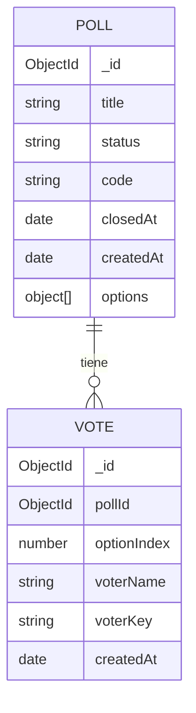

# 04 - Modelo de datos

## Enfoque de persistencia

PollClass guarda informacion en MongoDB usando Mongoose como capa de modelado.
El modelo esta disenado para resolver dos necesidades al mismo tiempo:

- consultar rapido el estado de una encuesta,
- mantener trazabilidad de cada voto emitido.

Por eso conviven una entidad agregada (`Poll`) y una entidad de eventos (`Vote`).

## Motor y colecciones

- Motor: MongoDB.
- ODM: Mongoose.
- Colecciones principales: `polls` y `votes`.

## Diagrama entidad-relacion

## Tabla logica: Poll

`Poll` representa la encuesta como unidad de trabajo.

Campos relevantes:

- `title`: obligatorio, texto recortado.
- `options`: arreglo de opciones con votos acumulados.
- `status`: `active` o `closed`.
- `code`: codigo publico de acceso, unico, uppercase, longitud 6.
- `closedAt`: fecha de cierre o `null`.
- `createdAt`: timestamp de creacion (automatico).

Subestructura de `options`:

| Campo | Tipo | Regla |
|---|---|---|
| `text` | string | obligatorio |
| `votes` | number | default 0, minimo 0 |

Restriccion clave: una encuesta debe tener al menos 2 opciones.

## Tabla logica: Vote

`Vote` representa cada voto individual para auditoria funcional y detalle de resultados.

Campos relevantes:

- `pollId`: referencia a encuesta (indexado).
- `optionIndex`: opcion elegida, basada en posicion del arreglo.
- `voterName`: nombre visible del estudiante.
- `voterKey`: clave normalizada para detectar duplicado.
- `createdAt`: momento del voto (automatico).

## Integridad y unicidad

Indices definidos:

- `Poll.code` unico.
- `Vote.pollId + Vote.voterKey` compuesto unico.

Resultado practico: dentro de una misma encuesta, una persona normalizada solo puede
votar una vez.

## Normalizacion del nombre de votante

Antes de insertar un voto, el backend transforma el nombre:

- quita espacios al inicio y final,
- convierte multiples espacios internos a uno,
- pasa todo a minusculas.

Ejemplo:

- Entrada: `"  Ana   Perez "`
- Clave normalizada: `"ana perez"`

Este mecanismo reduce duplicados por variaciones de formato sin perder el nombre
original que se muestra en la interfaz.

## Como se construyen los resultados

La respuesta de resultados combina dos fuentes:

1. Conteo por opcion guardado en `Poll.options[].votes`.
2. Lista detallada de votos consultada desde `Vote`.

Asi se obtiene una vista completa: resumen numerico y detalle por estudiante/hora.
