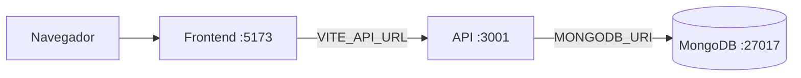
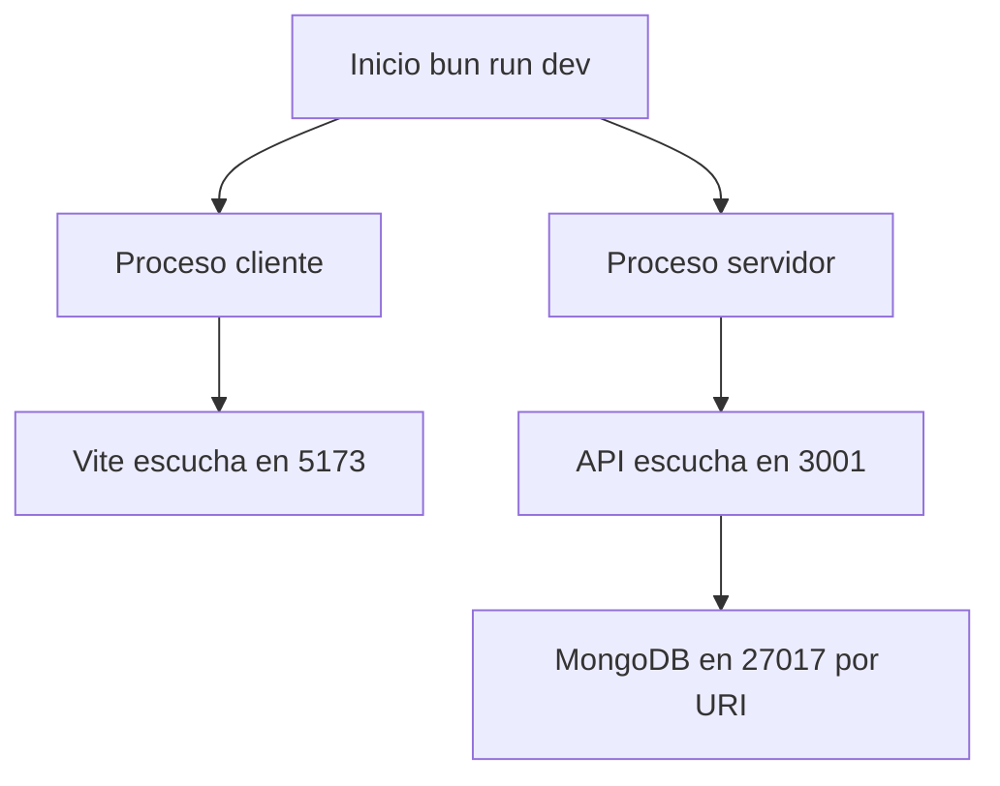

# 05 - Puertos y configuracion

## Por que importa este documento

Cuando una aplicacion "no responde", casi siempre el problema esta en una de estas tres
cosas: puerto, variable de entorno o dependencia externa. Este documento resume esa capa
operativa para acelerar diagnostico y puesta en marcha.

## Puertos de desarrollo

| Componente | Puerto | Configuracion |
|---|---|---|
| Frontend Vite | `5173` | `client/vite.config.ts` |
| API Bun + Hono | `3001` | `PORT` en entorno (default 3001) |
| MongoDB | `27017` | definido por la URI en `MONGODB_URI` |

## Mapa de conexiones

Lectura del diagrama:

- El navegador habla con Vite en `5173`.
- El frontend no habla directo con la base; siempre pasa por la API.
- La API resuelve y abre su conexion a MongoDB usando `MONGODB_URI`.

## Variables de entorno

| Variable | Requerida | Default | Consumida por |
|---|---|---|---|
| `VITE_API_URL` | no | `http://localhost:3001` | Frontend |
| `PORT` | no | `3001` | API |
| `MONGODB_URI` | no | `mongodb://127.0.0.1:27017/pollclass` | API |

## Resolucion de configuracion en runtime

- Frontend: usa `VITE_API_URL`; si no existe, aplica `http://localhost:3001`.
- API: usa `PORT`; si no existe, aplica `3001`.
- API: usa `MONGODB_URI`; si no existe, aplica URI local con base `pollclass`.

Esto permite que el proyecto arranque "out of the box" en local y al mismo tiempo sea
configurable para otros entornos.

## Secuencia de bind de puertos

## Guia rapida de problemas comunes

- Si `:5173` no abre, revisa que el proceso de Vite este activo.
- Si la UI carga pero falla todo request, valida `VITE_API_URL` y `:3001`.
- Si la API responde errores de base, valida `MONGODB_URI` y disponibilidad de MongoDB.
- Si cambias `PORT`, recuerda alinear tambien `VITE_API_URL`.
