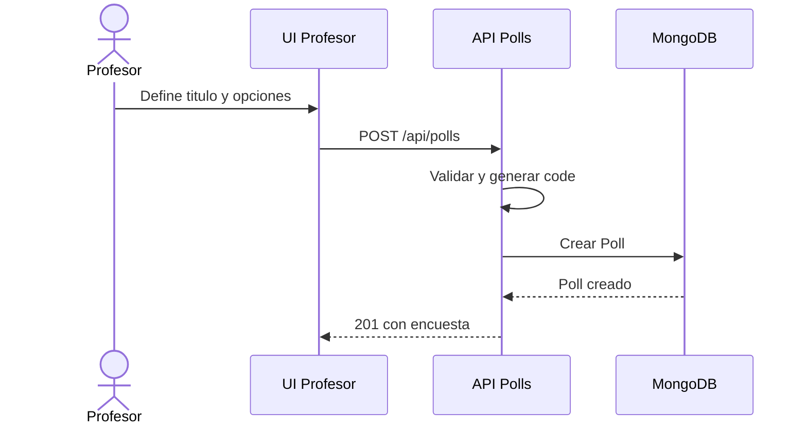
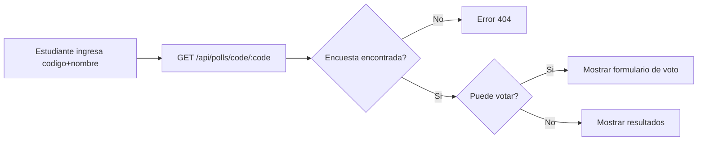
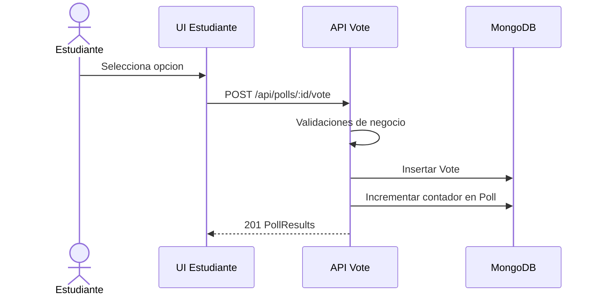
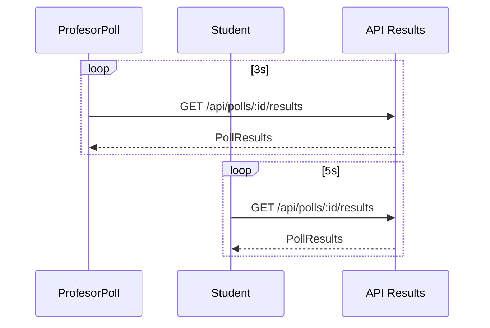
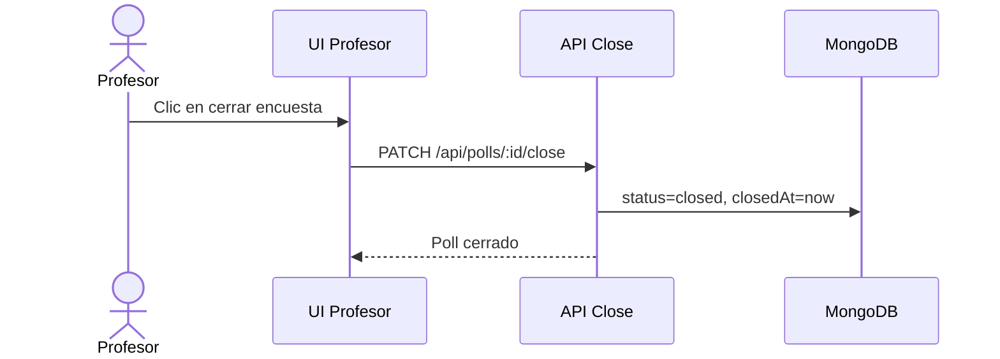
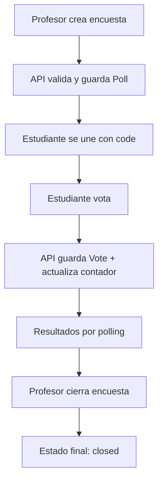

# 06 - Historia de una encuesta completa

## Introduccion

Este documento cuenta la historia funcional de PollClass de principio a fin, como si
siguiamos una encuesta real durante una clase. El objetivo es conectar arquitectura,
API, datos y experiencia de usuario en una sola narrativa.

## Capitulo 1: el profesor crea la encuesta

La historia empieza en la vista de profesor. El docente define un titulo y al menos
dos opciones. El frontend valida lo minimo de experiencia (campos vacios), pero la
validacion definitiva ocurre en backend para mantener reglas de negocio consistentes.

Cuando el formulario se envia:

- el frontend llama `POST /api/polls`,
- la API valida datos,
- genera un codigo de 6 caracteres,
- y persiste la encuesta en MongoDB.

Ese codigo es clave en la historia porque conecta a los estudiantes sin exponer ids
internos de base de datos.

## Capitulo 2: los estudiantes se unen por codigo

Cada estudiante abre la vista de estudiante, escribe el codigo y su nombre.
La aplicacion consulta `GET /api/polls/code/:code` para cargar estado actual,
opciones y votos ya registrados.

Aqui se decide si puede votar o solo observar:

- si la encuesta esta activa y no ha votado, puede emitir voto,
- si ya voto o esta cerrada, entra directo al modo resultados.

## Capitulo 3: el voto y la regla de una sola vez

Cuando el estudiante selecciona opcion y envia voto, backend aplica reglas que cuidan
la calidad de datos y la justicia de la votacion.

Validaciones relevantes:

- la encuesta debe existir,
- debe estar activa,
- la opcion debe ser valida,
- el nombre es obligatorio,
- no puede haber doble voto del mismo votante normalizado.

Si todo pasa:

1. se guarda un documento `Vote`,
2. se incrementa `Poll.options[optionIndex].votes`,
3. se responde con resultados actualizados.

## Capitulo 4: resultados vivos por polling

Despues del voto, tanto profesor como estudiante ven resultados que se refrescan cada
cierto tiempo con peticiones periodicas a `GET /api/polls/:id/results`.

- Profesor: cada 3 segundos.
- Estudiante (tras votar): cada 5 segundos.

Este mecanismo mantiene la sensacion de tiempo real sin agregar una capa de sockets.

## Capitulo 5: cierre de la encuesta

Cuando el profesor decide terminar la votacion, ejecuta la accion de cierre.
La API actualiza `status=closed` y completa `closedAt`.

Desde ese momento, cualquier intento de votar retorna conflicto y la historia de la
encuesta pasa a modo "solo lectura".

## Epilogo: que queda almacenado

Al final de la historia quedan dos niveles de informacion:

- `Poll`: foto consolidada de la encuesta (estado y acumulados por opcion).
- `Vote`: bitacora de eventos de voto (quien, que opcion, cuando).

Con eso se pueden reconstruir resultados, auditar actividad y mostrar historial.

## Mapa narrativo completo

