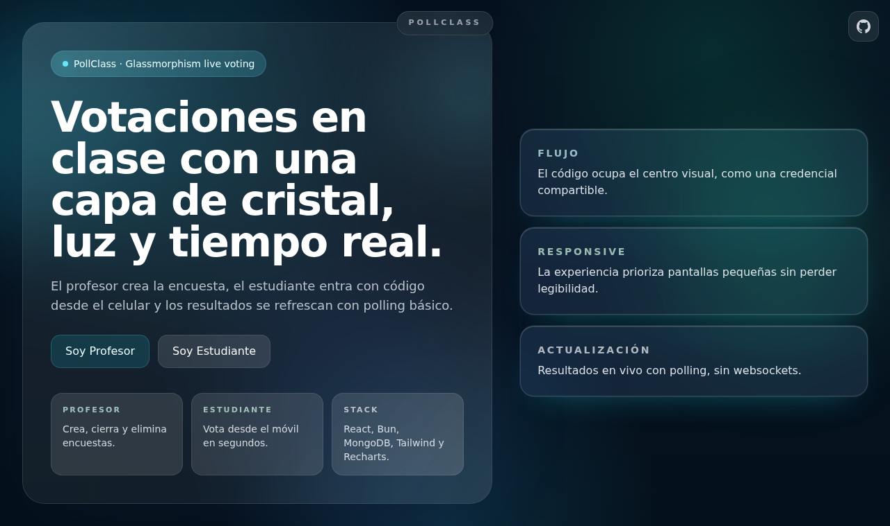
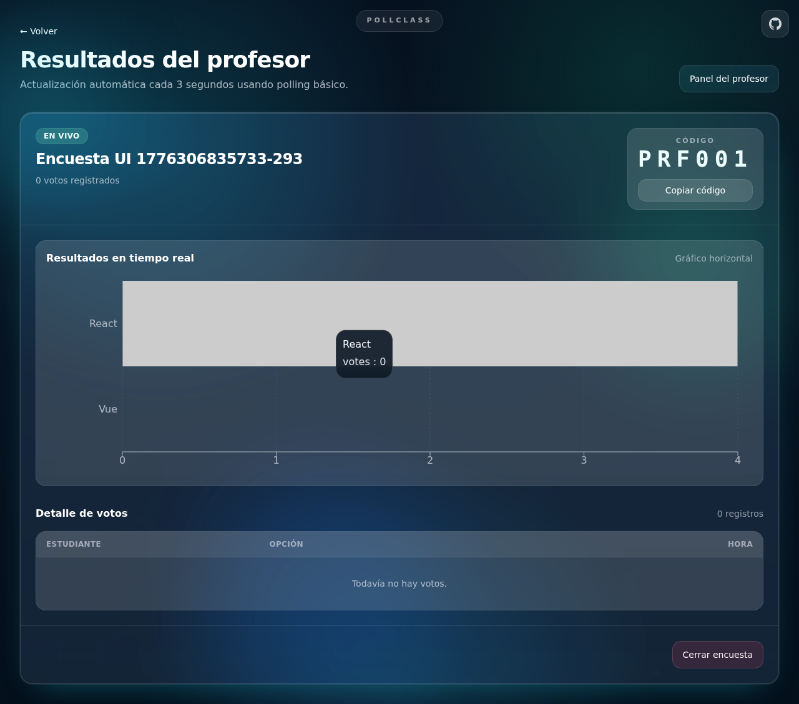
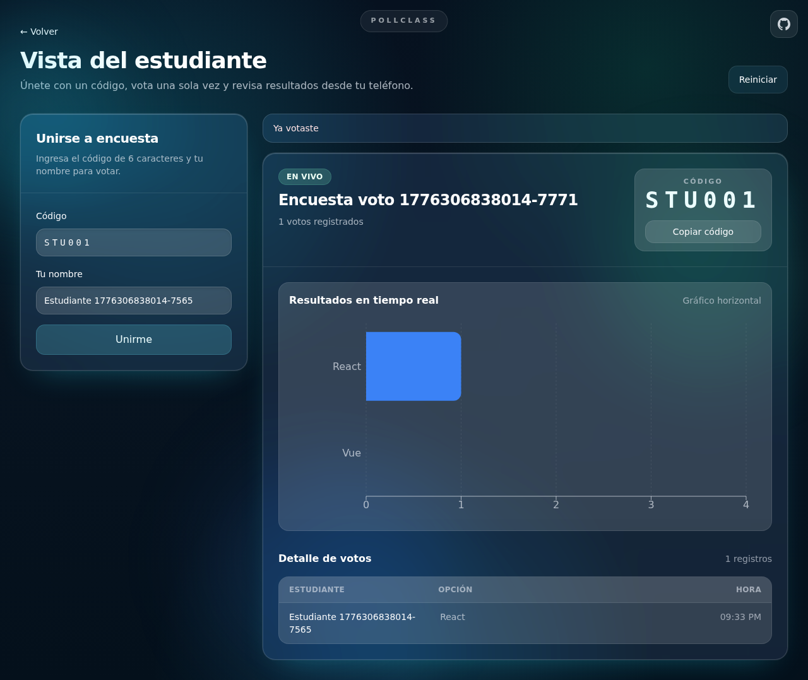

# PollClass - Laboratorio 5

Aplicación de encuestas en vivo para clase. El profesor crea y administra encuestas; el estudiante entra con código, vota una vez y ve resultados en tiempo real con polling.

## Stack

- Frontend: React + Vite + Tailwind + Recharts
- Backend: Bun + Hono + Mongoose
- Base de datos: MongoDB
- E2E: Playwright

## Estructura del laboratorio

- `client/`: interfaz web
- `server/`: API REST
- `docs/`: documentación técnica y operativa
- `tests/`: pruebas E2E y artefactos
- `docker-compose.yml`: ejecución completa con contenedores

## Ejecutar en local (modo directo)

### 1) Prerrequisitos

- Bun 1.x instalado
- MongoDB local activo en `mongodb://127.0.0.1:27017`

### 2) Instalar dependencias

```bash
bun install
```

### 3) Configurar variables de entorno

```bash
cp .env.example .env
```

Variables usadas por defecto:

- `MONGODB_URI=mongodb://127.0.0.1:27017/pollclass`
- `PORT=3001`
- `VITE_API_URL=http://localhost:3001`

### 4) Levantar app completa

```bash
bun run dev
```

Este comando inicia en paralelo:

- API backend en `http://localhost:3001`
- Frontend en `http://localhost:5173`

### 5) Verificar funcionamiento

- Abrir UI en `http://localhost:5173`
- Verificar healthcheck en `http://localhost:3001/health`
- Respuesta esperada del healthcheck: `{ "ok": true }`

## Ejecutar con Docker Compose

Desde `II. laboratorios/laboratorio5`:

### 1) Build + arranque

```bash
docker compose up --build
```

Si lo quieres en background:

```bash
docker compose up -d --build
```

### 2) Servicios expuestos

- Frontend: `http://localhost:5173`
- API: `http://localhost:3001`
- MongoDB: `mongodb://localhost:27017` (internamente la API usa `mongodb://mongodb:27017/pollclass`)

### 3) Detener servicios

```bash
docker compose down
```

Para eliminar también el volumen de MongoDB:

```bash
docker compose down -v
```

## Documentación del proyecto

La documentación principal está en:

- `docs/README.md`

Documentos clave:

- `docs/01-levantamiento-y-ejecucion.md`
- `docs/02-arquitectura-general.md`
- `docs/03-comunicacion-servicios.md`
- `docs/04-modelo-datos.md`
- `docs/05-puertos-y-configuracion.md`
- `docs/06-historia-de-una-encuesta.md`

## Tests

Toda la estrategia E2E vive en:

- `tests/README.md`
- `tests/playwright.config.ts`
- `tests/e2e/smoke/`
- `tests/e2e/integration/`
- `tests/e2e/validation/`

Comandos principales:

```bash
# suite completa
bun run test:e2e

# suites por alcance
bun run test:e2e:smoke
bun run test:e2e:integration
bun run test:e2e:validation

# filtros por etiquetas
bun run test:e2e:routes
bun run test:e2e:professor
bun run test:e2e:student

# utilidades
bun run test:e2e:report
```

## Flujos críticos cubiertos por E2E

1. Profesor crea encuesta y abre su vista de resultados.
2. Estudiante entra por código, vota una sola vez y ve resultados.
3. Profesor cierra encuesta y nuevos estudiantes quedan bloqueados para votar.

Caso negativo/validación adicional:

- Código de estudiante con longitud inválida (`5` caracteres) muestra error y no permite unirse.

## Capturas de pantalla

### Landing



### Vista profesor



### Vista estudiante



## Bitácora agéntica corta

- Qué pedí al agente:
  - Renombrar `laboratorio1` a `laboratorio5` y alinear referencias de CI/configuración.
  - Reestructurar README con ejecución local y Docker Compose.
  - Verificar cobertura E2E contra flujos críticos y agregar faltantes.
  - Incorporar capturas versionables dentro del repositorio.
- Qué acepté:
  - Nueva estructura E2E por carpetas (`smoke`, `integration`, `validation`).
  - Nuevas pruebas de integración reales sin mocks para los 3 flujos críticos.
  - Caso negativo de validación de formulario.
- Qué corregí yo:
  - Ajuste de scripts Playwright para nuevas rutas de specs.
  - Mejoras de locators estables con `data-testid` en formularios críticos.
- Cómo validé:
  - Ejecución de suite completa Playwright (`bun run test:e2e:all`): 9 passed.
  - Revisión de fallos bloqueantes y corrección antes de cierre.
  - Comprobación de rutas de documentación, tests y capturas en este README.
