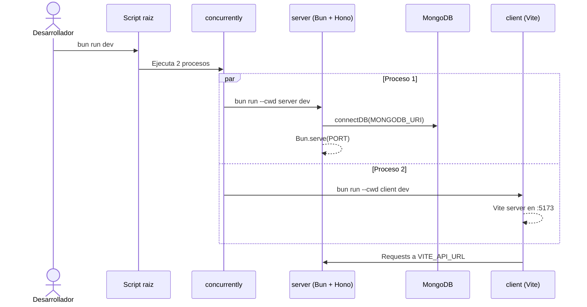

# 01 - Levantamiento y ejecucion

## Objetivo

En este documento se explica, paso a paso, como iniciar PollClass en entorno local y
que ocurre internamente cuando ejecutas los comandos principales. La idea es que no
solo sepas "que comando correr", sino tambien por que el sistema responde como responde.

## Antes de comenzar

Para correr la aplicacion necesitas:

- Bun 1.x instalado.
- MongoDB disponible y accesible desde la URI configurada.
- Dependencias del monorepo instaladas en la raiz.

PollClass esta dividido en dos workspaces:

- `client`: interfaz web con React y Vite.
- `server`: API HTTP con Bun + Hono + Mongoose.

El `package.json` raiz actua como orquestador y permite levantar ambos servicios
en paralelo durante el desarrollo.

## Configuracion inicial

Crea el archivo de entorno local a partir del ejemplo:

```bash
cp .env.example .env
```

Variables relevantes:

| Variable | Valor por defecto | Que controla |
|---|---|---|
| `MONGODB_URI` | `mongodb://127.0.0.1:27017/pollclass` | Conexion del backend a la base de datos |
| `PORT` | `3001` | Puerto donde la API queda escuchando |
| `VITE_API_URL` | `http://localhost:3001` | URL base que usa el frontend para llamar a la API |

Si no defines estas variables, el codigo aplica los valores por defecto indicados arriba.

## Comandos principales

Desde la raiz del proyecto:

```bash
bun install
bun run dev
```

Scripts disponibles:

- `bun run dev`: ejecuta cliente y servidor al mismo tiempo.
- `bun run server`: levanta solo la API.
- `bun run client`: levanta solo la UI.

## Que pasa internamente cuando corres `bun run dev`

El script `dev` usa `concurrently` para lanzar dos procesos. Es decir, una sola orden
del desarrollador arranca dos aplicaciones distintas que colaboran entre si.



## Lectura operativa del arranque

1. El backend inicia, registra middlewares globales y conecta con MongoDB.
2. Si la conexion es correcta, la API queda escuchando en `PORT` (3001 por defecto).
3. En paralelo, el frontend levanta Vite en `5173`.
4. Cuando el navegador carga la app, las llamadas de `services/api.ts` se dirigen a `VITE_API_URL`.

Si alguno de esos pasos falla, el sistema queda parcial:

- Si cae MongoDB, el backend no puede operar correctamente con encuestas/votos.
- Si cae la API, el frontend carga, pero mostrara errores al intentar consultar o mutar datos.
- Si cae Vite, la API sigue viva, pero no tendras interfaz visual.

## Verificacion rapida

- Frontend: `http://localhost:5173`
- API (salud): `http://localhost:3001/health`
- Respuesta esperada: `{ "ok": true }`

## Tip de diagnostico

Si la UI abre pero no muestra encuestas, revisa primero:

- que `VITE_API_URL` apunte a la API correcta,
- que el backend este arriba en `:3001`,
- y que MongoDB este accesible por `MONGODB_URI`.

## Ejecucion de pruebas E2E (Playwright)

La suite de pruebas de interfaz y flujos vive dentro de `tests/`.

Comandos principales desde la raiz:

```bash
# suite completa
bun run test:e2e

# instalar navegador de Playwright (si falta chromium)
bun run test:e2e:install

# instalar navegador + dependencias del sistema (Linux limpio)
bun run test:e2e:install:deps

# alias de suite completa
bun run test:e2e:all

# suites por alcance
bun run test:e2e:smoke
bun run test:e2e:routes
bun run test:e2e:professor
bun run test:e2e:student
bun run test:e2e:integration
bun run test:e2e:validation

# modos de ejecucion
bun run test:e2e:headed
bun run test:e2e:ui
bun run test:e2e:debug

# abrir reporte html
bun run test:e2e:report
```

Ubicacion de artefactos:

- Capturas por test: `tests/artifacts/capturas/`
- Videos por test: `tests/artifacts/videos/`
- Archivos de resultado Playwright: `tests/artifacts/test-results/`
- Reporte html: `tests/artifacts/playwright-report/`
