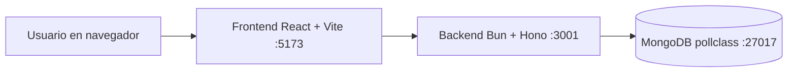

# Documentacion tecnica de PollClass

Esta carpeta explica el proyecto desde dos angulos: el tecnico y el operativo.
No solo describe archivos y puertos, tambien cuenta la historia de como una encuesta
nace, recibe votos y termina cerrada.

## Indice

- [01 - Levantamiento y ejecucion](./01-levantamiento-y-ejecucion.md)
- [02 - Arquitectura general](./02-arquitectura-general.md)
- [03 - Comunicacion entre servicios](./03-comunicacion-servicios.md)
- [04 - Modelo de datos](./04-modelo-datos.md)
- [05 - Puertos y configuracion](./05-puertos-y-configuracion.md)
- [06 - Historia de una encuesta completa](./06-historia-de-una-encuesta.md)
- [Capturas de la aplicacion](./screenshots/)
- [Testing Playwright (carpeta tests)](../tests/README.md)

## Vista rapida

## Como leer esta documentacion

- Si quieres levantar rapido el sistema, empieza por `01`.
- Si quieres entender la foto completa, sigue con `02` y `03`.
- Si quieres revisar datos e indices, ve a `04`.
- Si necesitas ajustar entorno local, consulta `05`.
- Si quieres una explicacion narrativa de punta a punta, lee `06`.

## Alcance

La documentacion cubre:

- Flujo de arranque y ejecucion en desarrollo.
- Arquitectura y responsabilidades por modulo.
- Comunicacion HTTP entre frontend y API.
- Estructura de base de datos, validaciones e indices.
- Puertos y resolucion de variables de entorno.

Todo el contenido esta alineado con el codigo actual del proyecto.
